# 🚀 ShopSphere Jenkins CI/CD Quick Start

Complete Jenkins CI/CD implementation for ShopSphere e-commerce platform.

## 📋 What's Included

- ✅ Jenkins running on port **9090** (Kafka-friendly)
- ✅ Complete CI/CD pipeline with automated testing
- ✅ GitHub webhook integration
- ✅ Docker-based deployment
- ✅ Security scanning & performance testing
- ✅ Multi-environment deployment (staging/production)
- ✅ Automated notifications

## 🚀 Quick Start (5 Minutes Setup)

### 1. Start Jenkins

```bash
cd /Users/coder/Downloads/ShopSphere-main/ShopSphere
./scripts/jenkins-setup.sh
```

### 2. Access Jenkins

- Open: http://localhost:9090
- Login with password from: `jenkins-admin-password.txt`
- Install suggested plugins

### 3. Create Pipeline Job

1. New Item → Pipeline
2. Name: `ShopSphere-CI-CD`
3. Pipeline from SCM → Git
4. Repository: Your GitHub repo URL
5. Script Path: `Jenkinsfile`

### 4. Configure GitHub Webhook

- Repository Settings → Webhooks
- URL: `http://localhost:9090/github-webhook/`
- Content-type: `application/json`
- Events: Push events

### 5. Test the Pipeline

```bash
# Make a test commit
echo "# Test CI/CD" >> test.md
git add test.md
git commit -m "Test Jenkins CI/CD pipeline"
git push origin main
```

## 🏗️ Architecture Overview

```
┌─────────────────┐    ┌─────────────────┐    ┌─────────────────┐
│   GitHub Repo   │───▶│   Jenkins       │───▶│   Docker        │
│   (Port: N/A)   │    │   (Port: 9090)  │    │   Containers    │
└─────────────────┘    └─────────────────┘    └─────────────────┘
         │                       │                       │
         │                       ▼                       ▼
         │              ┌─────────────────┐    ┌─────────────────┐
         │              │   Test Runner   │    │   Staging Env   │
         │              │   (Automated)   │    │   (Port: 8001)  │
         │              └─────────────────┘    └─────────────────┘
         │                       │                       │
         ▼                       ▼                       ▼
┌─────────────────┐    ┌─────────────────┐    ┌─────────────────┐
│   Webhook       │    │   Security      │    │   Production    │
│   Triggers      │    │   Scanning      │    │   (Port: 8000)  │
└─────────────────┘    └─────────────────┘    └─────────────────┘
```

## 📂 File Structure

```
ShopSphere/
├── Jenkinsfile                     # Main CI/CD pipeline
├── .jenkins.env                    # Jenkins environment config
├── docker-compose.override.yml     # CI/CD Docker overrides
├── jenkins/
│   ├── docker-compose.jenkins.yml  # Jenkins setup
│   ├── Dockerfile.jenkins          # Custom Jenkins image
│   └── plugins.txt                 # Required plugins
├── scripts/
│   ├── jenkins-setup.sh           # 🚀 Main setup script
│   ├── test-runner.sh             # Testing automation
│   └── deploy.sh                  # Deployment automation
└── docs/
    ├── webhook-setup.md            # GitHub webhook guide
    └── jenkins-pipeline-setup.md   # Detailed setup guide
```

## 🔄 CI/CD Pipeline Flow

### Trigger: Git Commit → GitHub Webhook → Jenkins

```mermaid
graph LR
    A[Git Push] --> B[GitHub Webhook]
    B --> C[Jenkins Triggered]
    C --> D[Checkout Code]
    D --> E[Build Apps]
    E --> F[Run Tests]
    F --> G[Security Scan]
    G --> H[Deploy Staging]
    H --> I[Performance Test]
    I --> J[Deploy Production]
    J --> K[Notify Team]
```



### Pipeline Stages

1. **🚀 Checkout & Setup** - Clean workspace, checkout code
2. **🔍 Pre-build Checks** - Validate dependencies, Docker
3. **🏗️ Build Applications** - Build backend & frontend Docker images
4. **🧪 Run Tests** - Backend (pytest), Frontend (Jest), Integration
5. **🔐 Security & Quality** - Vulnerability scanning, code analysis
6. **🚢 Deploy Staging** - Automated staging deployment
7. **📊 Performance Tests** - Load testing with k6
8. **🎯 Deploy Production** - Manual approval for production
9. **🔔 Notifications** - Slack/Email notifications

## 🧪 Testing Strategy

### Backend Tests

- **Unit Tests**: pytest with coverage
- **API Tests**: FastAPI TestClient
- **Database Tests**: SQLAlchemy fixtures
- **Security Tests**: bandit, safety

### Frontend Tests

- **Unit Tests**: Jest + React Testing Library
- **Component Tests**: Isolated component testing
- **Integration Tests**: API integration
- **Security Tests**: npm audit

### Integration Tests

- **End-to-End**: Full application flow
- **API Integration**: Backend-Database-Redis-Kafka
- **Performance**: Load testing with k6

## 🚀 Deployment Strategy

### Staging Environment

- **Trigger**: Any push to `main` or `develop`
- **URL**: http://localhost:8001 (Frontend), http://localhost:8001 (Backend)
- **Database**: Isolated staging database
- **Purpose**: Final testing before production

### Production Environment

- **Trigger**: Manual approval after staging success
- **URL**: http://localhost:3000 (Frontend), http://localhost:8000 (Backend)
- **Strategy**: Blue-Green deployment
- **Rollback**: Automated rollback on health check failure

## 🔔 Notifications

### Success Notifications

- ✅ Build completed successfully
- 🚀 Deployed to staging/production
- 📊 Test coverage reports
- ⏱️ Build duration metrics

### Failure Notifications

- ❌ Build failed with logs
- 🔧 Failed test details
- 🛡️ Security vulnerabilities found
- 🚨 Deployment failures

## 🛠️ Available Scripts

```bash
# Setup Jenkins (one-time)
./scripts/jenkins-setup.sh

# Run tests locally
./scripts/test-runner.sh

# Deploy to staging
./scripts/deploy.sh --environment staging

# Deploy to production
./scripts/deploy.sh --environment production

# View Jenkins logs
docker logs shopsphere_jenkins -f

# Stop Jenkins
docker-compose -f jenkins/docker-compose.jenkins.yml down
```

## 🔧 Configuration

### Environment Variables (.jenkins.env)

```bash
JENKINS_URL=http://localhost:9090
DOCKER_REGISTRY=localhost:5000
SLACK_WEBHOOK_URL=https://hooks.slack.com/...
EMAIL_NOTIFICATION=your-email@example.com
```

### Port Configuration

- **Jenkins**: 9090 (avoids Kafka's 8080)
- **Backend Staging**: 8001
- **Frontend Staging**: 3001
- **Backend Production**: 8000
- **Frontend Production**: 3000
- **Jenkins Agent**: 50000
- **Jenkins DB**: 5433

## 🔍 Monitoring & Debugging

### View Build Status

```bash
# Jenkins dashboard
open http://localhost:9090

# Check running containers
docker ps

# View application logs
docker-compose logs -f backend frontend
```

### Debug Failed Builds

```bash
# Jenkins build logs
docker logs shopsphere_jenkins

# Test runner logs
./scripts/test-runner.sh

# Application health check
curl http://localhost:8000/health
curl http://localhost:3000
```

## 🆘 Troubleshooting

### Common Issues

**Jenkins won't start**

```bash
# Check port availability
lsof -i :9090

# Check Docker
docker ps
docker logs shopsphere_jenkins
```

**Webhook not triggering**

```bash
# Test webhook manually
curl -X POST http://localhost:9090/github-webhook/

# Check GitHub webhook delivery
# Go to repo Settings → Webhooks → Recent Deliveries
```

**Build failures**

```bash
# Check Docker permissions
docker exec shopsphere_jenkins docker ps

# Clean up space
docker system prune -a

# Reset Jenkins
docker-compose -f jenkins/docker-compose.jenkins.yml down
./scripts/jenkins-setup.sh
```

## 📚 Documentation

- 📖 [Detailed Pipeline Setup](docs/jenkins-pipeline-setup.md)
- 🔗 [GitHub Webhook Configuration](docs/webhook-setup.md)
- 🐳 [Docker Configuration Guide](docker-compose.override.yml)
- 🧪 [Testing Strategy Details](scripts/test-runner.sh)

## 🎯 Next Steps

1. **Customize for your needs**:

   - Update GitHub repository URL in configs
   - Configure Slack/email notifications
   - Adjust test configurations

2. **Enhance the pipeline**:

   - Add more comprehensive tests
   - Implement infrastructure as code
   - Add monitoring and alerting

3. **Scale up**:
   - Move to cloud-based Jenkins
   - Implement Kubernetes deployment
   - Add multi-region deployment

## 📈 Features

### ✅ Current Features

- Automated CI/CD pipeline
- Multi-environment deployment
- Comprehensive testing
- Security scanning
- Performance testing
- GitHub integration
- Docker containerization
- Automated notifications

### 🚀 Future Enhancements

- Kubernetes deployment
- Infrastructure as Code (Terraform)
- Advanced monitoring (Prometheus/Grafana)
- Multi-cloud deployment
- Automated performance optimization
- Advanced security scanning

---

## 🎉 You're All Set!

Your Jenkins CI/CD pipeline is ready! Every git commit will now trigger:

1. Automated testing
2. Security scanning
3. Staging deployment
4. Optional production deployment

**Happy Coding! 🚀**
